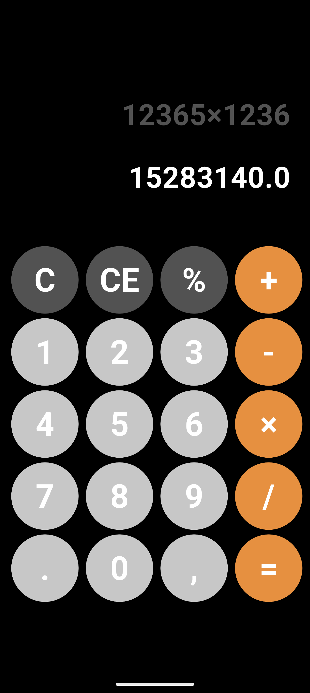
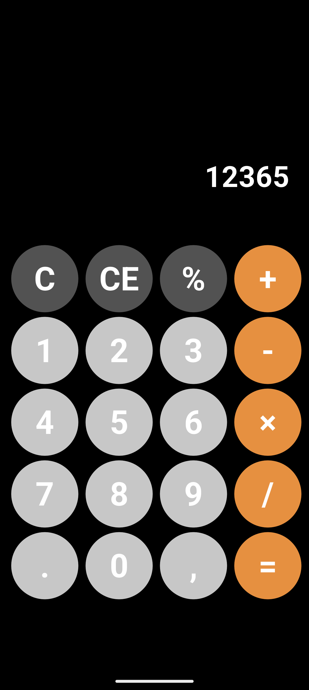
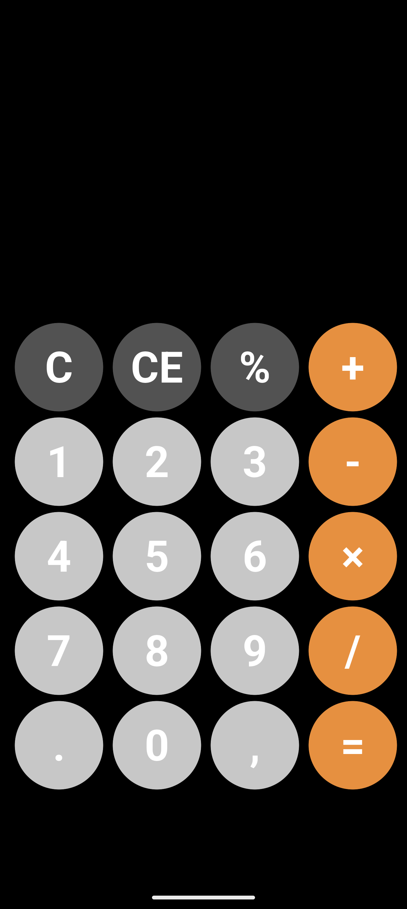

# Flutter Calculator App

A simple **Calculator application built with Flutter** that allows users to perform basic arithmetic operations like addition, subtraction, multiplication, and division.  
The app features a clean and modern user interface, mimicking standard calculator functionalities.

---

## Screenshots

| Start Screen | Input | Result |
|-------------|------------|---------------|
|  |  |  |

---

## Dependencies

- Flutter
- Dart

---

## Run the Project

```bash
git clone https://github.com/siam4201/calculator_app.git
cd calculator_app
flutter pub get
flutter run
```
